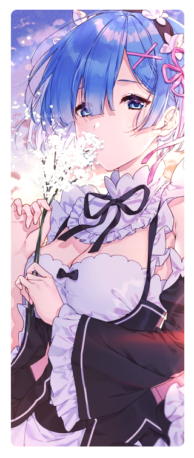

#

 
 

 
  
- Name: **Vu Duc Long**

- Font-End Developer **4+ years** experience.

- Studying: ***Machine Learning and Website Developing***.

- Good with **Javascript**, **Typescript**, **C++**, **CSS**, **HTML** and **Python**.

- Familiar with **Debian**, **Ubuntu** and **Linux**.

- Understand **Vietnamese (Native)**, and **English (Fluent)**.

 
 

 
 
  
- 📗 [***longvuu/Discord-Voice_Self-Bot***](https://github.com/longvuu/Discord-Voice_Self-Bot)  
  A Discord self-bot that supports voice
- 📘 [***longvuu/Cpp-Code***](https://github.com/longvuu/Cpp-Code)  
  A complete collection of C++ solutions for exercises and problems.
- 📙 [***longvuu/ext***](https://github.com/longvuu/ext)  
  Extension for the VBook app
 

  

