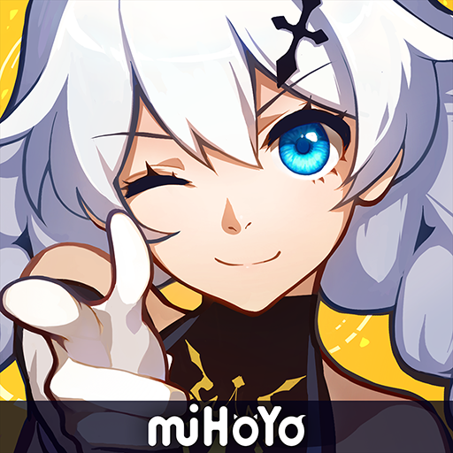
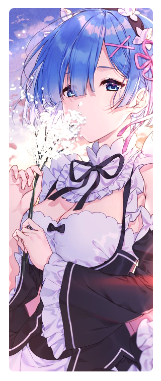

#

 
 

 
  
- Name: **Vu Duc Long**

- Front-End Developer.

- Some games I play:  **Honkai Impact 3rd**,  **Honkai: Star Rail**,  **LOL**,  **Honor of Kings**

- Good with 
   **Javascript**, 
   **Typescript**, 
   **C++**, 
   **Python**.

- Understand  **Vietnamese (Native)**, và  **English (Fluent)**.

 
 

 
 
  
- 📗 [***longvuu/Discord-Voice_Self-Bot***](https://github.com/longvuu/Discord-Voice_Self-Bot)  
  A Discord self-bot that supports voice 
- 📘 [***longvuu/KuroOj***](https://github.com/longvuu/KuroOj)   
  My Online Judge Code.
- 📙 [***longvuu/ext***](https://github.com/longvuu/ext)  
  Extension for the VBook app
 

  

